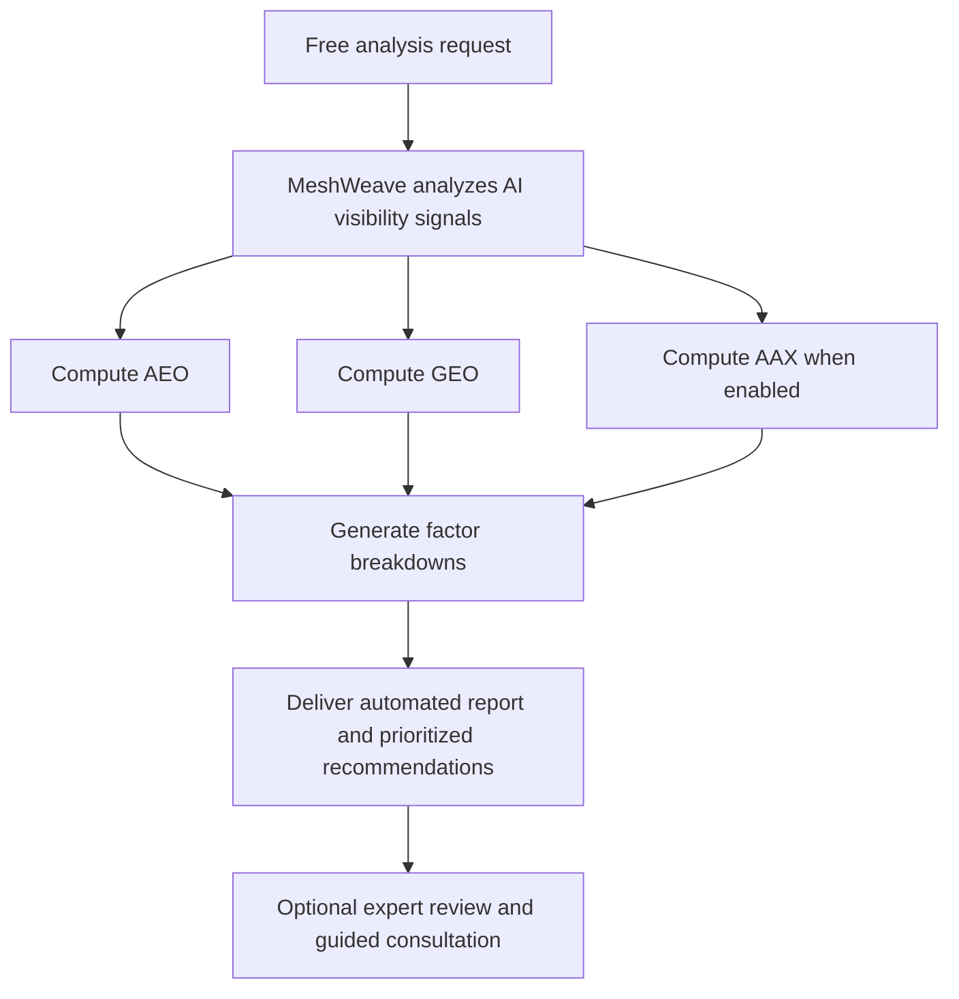

# Product Overview — MeshWeave

MeshWeave is an AI visibility audit service. We show companies how well their website can be crawled, understood, cited, and acted on by answer engines, LLMs, and AI agents — then we tell them exactly what to fix first.

Every audit is built around three diagnostic lenses:

- **AEO** — Answer Engine Optimization
- **GEO** — Generative Engine Optimization
- **AAX** — AI Agent Experience

Together, these lenses help teams find the structural weaknesses that reduce AI discoverability, citation confidence, recommendation likelihood, and agent usability.

## 1) Service Summary

- **Category:** AI visibility audit service
- **Core job:** Diagnose how AI systems interpret a website and deliver prioritized recommendations, with optional expert guidance
- **Primary deliverable:** A structured automated analysis showing where AI visibility breaks down across extraction, authority, and agent usability — with clear guidance on what to fix first; expert-guided review is an optional follow-up
- **Who we serve:**
  - Marketing and growth teams
  - SEO and content teams
  - Founders and operators
  - Agencies and consultants
  - Product and web teams responsible for site structure

## 2) Problem MeshWeave Solves

Traditional analytics and SEO tools do not answer the questions teams now care about:

- Can AI systems extract trusted answers from our pages?
- Can LLMs understand what we do and cite us accurately?
- Can AI systems identify a credible next step from our site?
- Which technical or content issues most reduce AI visibility?
- What should we fix first to improve citation, recommendation, and discoverability?

Most teams don't have the expertise or tooling to answer these questions on their own. MeshWeave provides the analysis, the framework, and the expert interpretation to answer them directly.

## 3) How We Evaluate

MeshWeave analyzes a website across three diagnostic lenses, each measuring a different dimension of AI visibility risk.

### A) AEO — Answer Engine Optimization

AEO measures how well a site is structured for answer extraction by systems such as featured snippets, AI Overviews, and voice assistants.

We evaluate signals including:

- Schema implementation
- Content structure quality
- Freshness
- Capture rate
- Query match
- Voice response readiness

What it means for the business:

- Low AEO suggests AI systems may struggle to extract concise, trusted answers
- High AEO suggests content is easier for answer engines to parse and reuse

### B) GEO — Generative Engine Optimization

GEO measures how well a site is positioned to be cited or recommended by LLM-driven systems such as ChatGPT, Claude, and Perplexity.

We evaluate signals including:

- Citation presence
- Topical authority
- E-E-A-T signals
- Crawl accessibility for LLM bots
- Content depth
- Entity consistency

What it means for the business:

- Low GEO suggests weak authority, weak machine-readable trust signals, or crawl limitations
- High GEO suggests the site is more likely to be cited, referenced, or recommended in generative experiences

### C) AAX — AI Agent Experience

AAX measures how well an AI system can understand, evaluate, and recommend a
website from its crawled content and metadata. It is not an interactive browser
agent and does not test checkout, form submission, or other transactions.

We evaluate signals including:

- Homepage comprehension from rendered homepage content
- Metadata optimization from title, description, Open Graph, Twitter, canonical, and JSON-LD data
- Cross-page content understanding and coherence
- `llms.txt` and `llms-full.txt` availability
- Email validation and heuristic contactability

What it means for the business:

- Low AAX suggests AI systems may struggle to understand the offer, locate the right information, or identify a credible next step
- High AAX suggests the site is easier for AI systems to interpret and recommend

## 4) How the Scores Work

All three scores use a weighted composite model.

- Each factor contributes according to a defined weight
- Missing manual inputs are excluded and weights are re-normalized across available factors
- A calibration curve compresses inflated mid-range scores
- Final outputs are capped at 100 and rounded

This allows our team to combine automated scanning with deeper manual evaluation where machine-only analysis is incomplete.

## 5) What Clients Get

Every MeshWeave audit delivers:

- AEO, GEO, and AAX scores with factor-level breakdowns
- Plain-language ratings that translate raw scores into clear performance bands
- Prioritized recommendations on what to fix first
- A clear view of where AI visibility is strongest and weakest
- Expert interpretation explaining what the findings mean for the business

In practical terms, our audits help teams:

- Stop losing citations to competitors
- Improve recommendation confidence in generative interfaces
- Increase AI discoverability
- Reduce structural ambiguity that confuses AI systems
- Prepare sites for AI-assisted commerce and agent interaction

## 6) How the Engagement Works

## 7) Positioning

MeshWeave is not a traditional SEO tool. It provides an automated analysis and
prioritized findings, with optional expert-guided interpretation.

It is an AI visibility analysis service focused on whether machines can:

- crawl the site
- understand the brand and offering
- extract useful answers
- trust the entity signals
- recommend the business in generative interfaces
- identify a credible next step from the site

The product performs the automated analysis and explains what to fix and why it
matters. Expert review is available when teams need additional interpretation.

## 8) Core Messaging

The service messaging is centered on AI visibility risk and expert-guided clarity.

Core themes:

- Your AI profile can become a business liability
- AI systems may be misunderstanding or ignoring important parts of your site
- Visibility problems can be measured — but interpreting them requires expertise
- Structural weaknesses can be prioritized based on business impact
- The goal is to move from invisible to cited

The service promise: we show exactly how AI systems read your site, where they fail, and what to fix first — so you don't have to figure it out alone.

## 9) Ideal Use Cases

MeshWeave is well suited for:

- Auditing a marketing site for AI discoverability before a launch or rebrand
- Diagnosing why a brand is not being cited in AI-generated answers
- Improving trust and authority signals for LLMs with expert guidance
- Making a website easier for AI agents to navigate and use
- Getting a prioritized action plan based on AI-readability impact
- Providing clients or leadership with a clear AI visibility assessment and next steps

## 10) Differentiators

- Expert-led service, not a self-service tool — we do the work and explain the results
- Purpose-built for AI visibility rather than legacy SEO reporting
- Separates answer extraction, generative authority, and agent usability into distinct diagnostic lenses
- Combines automated scoring with manual expert evaluation where machine-only analysis falls short
- Delivers recommendations tied directly to score factors and business impact
- Frames everything in business terms: citation risk, recommendation confidence, and agent readiness

## 11) Short Pitch

MeshWeave helps teams understand how AI systems crawl, interpret, cite, and act on their websites. We do the analysis, prioritize the fixes, and guide you through what matters most — so your site stops being invisible to the machines that are shaping how buyers discover and choose vendors.
