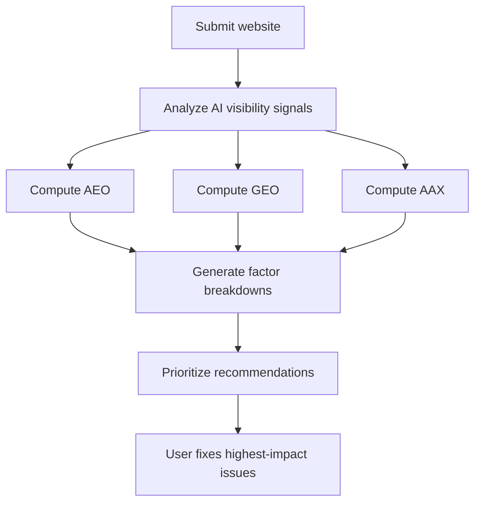

# Product Overview — MeshWeave

MeshWeave is an AI visibility audit product. It shows how well a website can be crawled, understood, cited, and acted on by answer engines, LLMs, and AI agents.

The product is built around three diagnostic scores:

- **AEO** — Answer Engine Optimization
- **GEO** — Generative Engine Optimization
- **AAX** — AI Agent Experience

Together, these scores help teams find the structural weaknesses that reduce AI discoverability, citation confidence, recommendation likelihood, and agent usability.

License: MIT

## 1) Product Summary

- **Category:** AI visibility audit and scoring platform
- **Core job:** Analyze how AI systems interpret a website and prioritize the highest-impact fixes
- **Primary output:** A structured report showing where AI visibility breaks down across extraction, authority, and agent usability
- **Primary users:**
  - Marketing and growth teams
  - SEO and content teams
  - Founders and operators
  - Agencies and consultants
  - Product and web teams responsible for site structure

## 2) Problem MeshWeave Solves

Traditional analytics and SEO tools do not answer the questions teams now care about:

- Can AI systems extract trusted answers from our pages?
- Can LLMs understand what we do and cite us accurately?
- Can AI agents navigate our site and complete meaningful tasks?
- Which technical or content issues most reduce AI visibility?
- What should we fix first to improve citation, recommendation, and discoverability?

MeshWeave is designed to answer those questions directly.

## 3) What the Product Does

MeshWeave analyzes a website and produces three diagnostic views into AI visibility risk.

### A) AEO — Answer Engine Optimization

AEO measures how well a site is structured for answer extraction by systems such as featured snippets, AI Overviews, and voice assistants.

It evaluates signals including:

- Schema implementation
- Content structure quality
- Freshness
- Capture rate
- Query match
- Voice response readiness

Business meaning:

- Low AEO suggests AI systems may struggle to extract concise, trusted answers
- High AEO suggests content is easier for answer engines to parse and reuse

### B) GEO — Generative Engine Optimization

GEO measures how well a site is positioned to be cited or recommended by LLM-driven systems such as ChatGPT, Claude, and Perplexity.

It evaluates signals including:

- Citation presence
- Topical authority
- E-E-A-T signals
- Crawl accessibility for LLM bots
- Content depth
- Entity consistency

Business meaning:

- Low GEO suggests weak authority, weak machine-readable trust signals, or crawl limitations
- High GEO suggests the site is more likely to be cited, referenced, or recommended in generative experiences

### C) AAX — AI Agent Experience

AAX measures how well an AI agent can understand, evaluate, and act on a website.

It evaluates signals including:

- Homepage comprehension
- Meta optimization
- Cross-page content understanding
- `llms.txt` availability
- Email validation and contactability

Business meaning:

- Low AAX suggests agents may struggle to understand the offer, locate the right information, or complete tasks reliably
- High AAX suggests the site is easier for agents to interpret and use in agentic workflows

## 4) How the Scores Work

All three scores use a weighted composite model.

- Each factor contributes according to a defined weight
- Missing manual inputs are excluded and weights are re-normalized across available factors
- A calibration curve compresses inflated mid-range scores
- Final outputs are capped at 100 and rounded

This makes the scoring system usable in both automated scans and richer human-assisted evaluations.

## 5) What Users Get

MeshWeave turns a scan into an actionable diagnostic report.

Users get:

- AEO, GEO, and AAX scores
- Factor-level breakdowns behind each score
- Ratings that translate raw scores into plain-language performance bands
- Prioritized recommendations on what to fix first
- A clear view of where AI visibility is strongest and weakest

In practical terms, the product helps teams:

- Stop losing citations
- Improve recommendation confidence
- Increase AI discoverability
- Reduce structural ambiguity
- Prepare sites for AI-assisted commerce and agent interaction

## 6) Product Positioning

MeshWeave is not a traditional SEO platform.

It is an AI visibility audit system focused on whether machines can:

- crawl the site
- understand the brand and offering
- extract useful answers
- trust the entity signals
- recommend the business in generative interfaces
- complete actions as an AI agent

This makes the product relevant for teams preparing for AI-native discovery, not only search ranking.

## 7) Core Messaging

The current product messaging is centered on AI visibility risk and diagnostic clarity.

Core themes:

- Your AI profile can become a business liability
- AI systems may be misunderstanding or ignoring important parts of your site
- Visibility problems can be measured
- Structural weaknesses can be prioritized
- The goal is to move from invisible to cited

The product promise is simple: show exactly how AI systems read a site, where they fail, and what to fix first.

## 8) Ideal Use Cases

MeshWeave is well suited for:

- Auditing a marketing site for AI discoverability
- Diagnosing why a brand is not cited in AI-generated answers
- Improving trust and authority signals for LLMs
- Making a website easier for AI agents to navigate and use
- Prioritizing technical and content work based on AI-readability impact
- Sharing AI visibility assessments with internal teams or clients

## 9) High-Level User Journey

## 10) Differentiators

- Purpose-built for AI visibility rather than legacy SEO reporting
- Separates answer extraction, generative authority, and agent usability into distinct lenses
- Combines automated scoring with optional manual inputs where machine-only analysis is incomplete
- Produces recommendations tied directly to score factors
- Frames outputs in business terms such as citation risk, recommendation confidence, and agent readiness

## 11) Short Pitch

MeshWeave helps teams understand how AI systems crawl, interpret, cite, and act on their websites—then shows them what to fix first to improve AI visibility.
